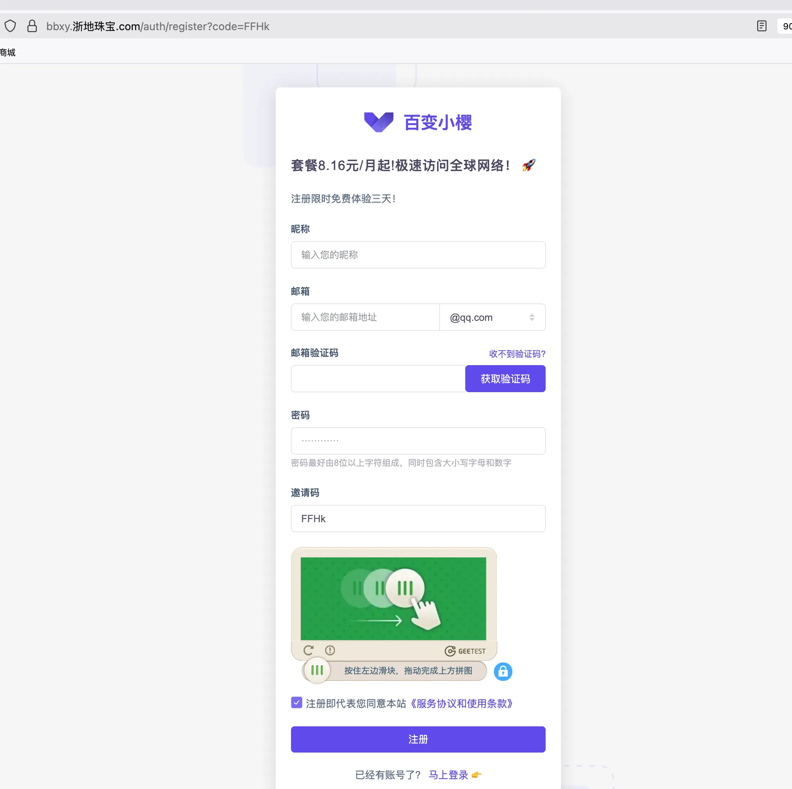
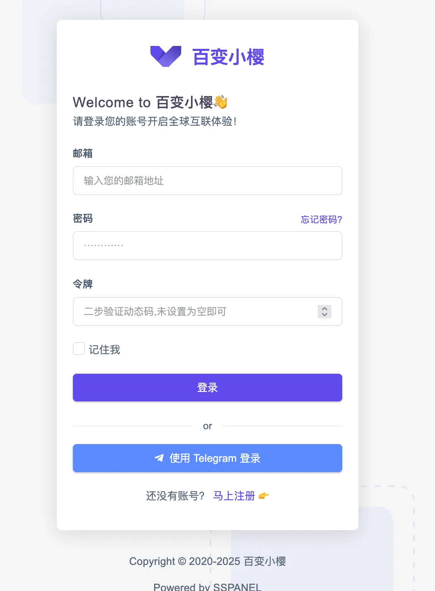
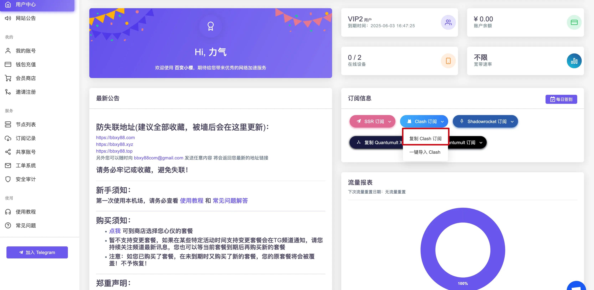
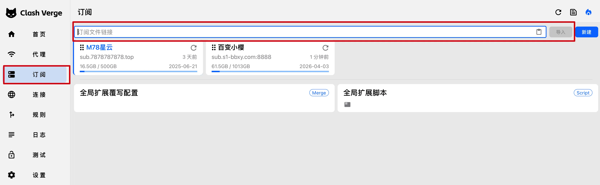
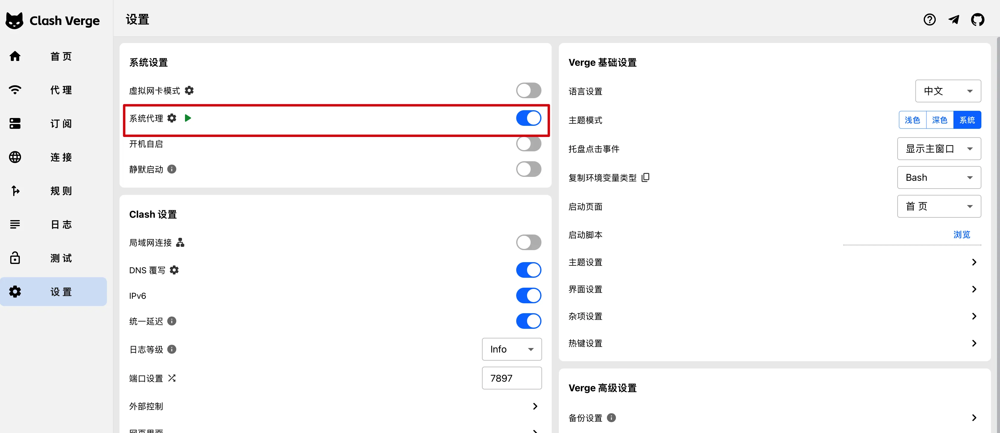
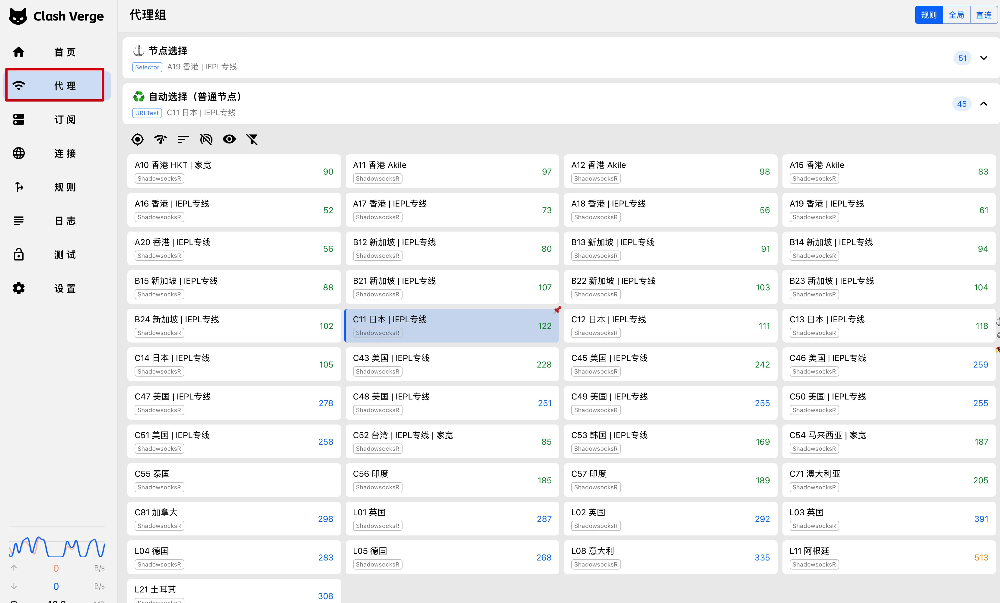
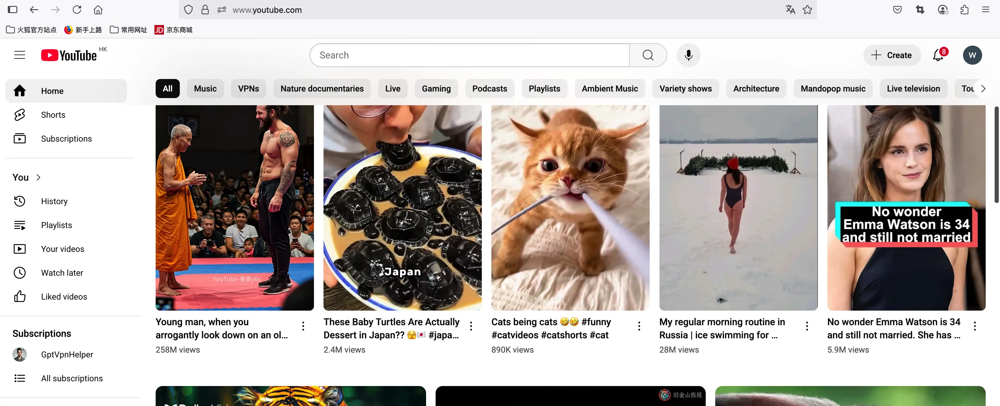
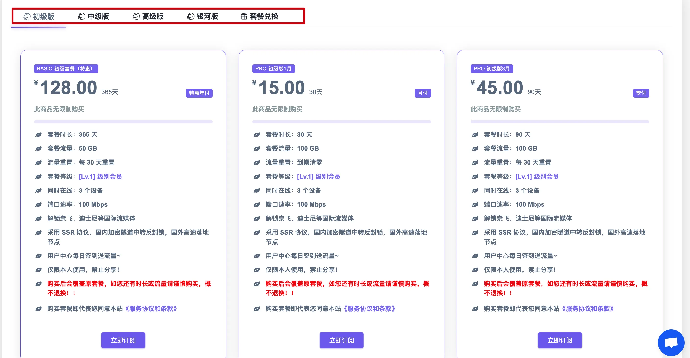

# Clash 机场零基础订阅教程

本教程以 **百变小樱机场** 为示例进行演示，其他机场的使用方式基本一致，便于参考操作。

该机场对新用户提供**免费 1 天 IEPL 高速专线体验**，注册后即可使用，无需付费。如果你试用后觉得不满意，也可以随时更换其他机场服务。

在中国大陆使用 Clash + 机场服务时，**请务必关闭或卸载国产杀毒软件**（如 360、腾讯管家等），以防敏感行为被后台上传触发风控 —— 懂的都懂，谨慎是第一步。

---

## 1. 注册账号

前往官网注册: [https://bbxy.xn--cesw6hd3s99f.com/auth/register?code=FFHk](https://bbxy.xn--cesw6hd3s99f.com/auth/register?code=FFHk)

注册时请填写邮箱和密码，验证码发送至邮箱，请查收后填写。

---

## 2. 登录账号

注册成功后，使用你的邮箱和密码登录网站后台。

---

## 3. 复制订阅链接

进入网站后台，点击 "订阅" 或 "获取订阅链接"，复制你的专属订阅链接（一般是以 `https://` 开头的一串字符）。

⚠️ 注意：不要泄露你的订阅链接，它相当于你的账号密钥。

---

## 4. 下载安装 机场软件

推荐使用 Clash 系列软件，以下是各平台常用软件,下载并安装适合你设备的客户端,看自己的操作系统和芯片型号选择合适的版本,
如不能使用检查一下系统和芯片型号是否匹配,或者换一个软件尝试

| 平台              | 软件名称         | 下载地址                                                                 |
|-----------------|------------------|--------------------------------------------------------------------------|
| **Windows**     | Clash Verge      | [GitHub 下载](https://github.com/zzzgydi/clash-verge/releases)          |
|                 | Mihomo-Party     | [GitHub 下载](https://github.com/mihomo-party-org/mihomo-party/releases)       |
| **macOS**       | Clash Verge      | [GitHub 下载](https://github.com/zzzgydi/clash-verge/releases)          |
|                 | ClashX Meta      | [GitHub 下载](https://github.com/MetaCubeX/ClashX.Meta/releases)        |
| **Android**     | Clash Meta       | [GitHub 下载](https://github.com/MetaCubeX/ClashMetaForAndroid/releases)|
| **iOS**(需要外区账号) | Shadowrocket     | [App Store（付费）](https://apps.apple.com/app/shadowrocket/id932747118)|
|                 | Stash            | [App Store（付费）](https://apps.apple.com/app/stash-rule-based-proxy/id1596063349)|

---

## 5. 把订阅链接配置到软件中

以 Clash Verge 为例，在菜单左侧找到配置订阅的入口：

1. 粘贴你的订阅链接。
2. 点击导入。

---

## 6. 设置系统代理

启用系统代理，确保浏览器和其他软件可以通过 Clash 上网：

- Windows/Mac 通常在软件内点击“一键设置系统代理”即可。
- Android/iOS 需要手动配置或使用自动代理模式。

## 7. 选择一个节点

选择一个自己想要连接的延迟低的节点

---

## 8. 查看能否打开 YouTube

打开浏览器访问 [https://www.youtube.com](https://www.youtube.com)，如果可以正常访问并播放视频，则说明代理成功。

## 9. 选择套餐

机场都是有付费套餐的,可以根据自己对流量和带宽的需求选择合适的套餐,以**百变小樱**机场为例,套餐覆盖了多种场景,完全可以根据自己的需求选择

覆盖了初级版、中级版、高级版、银河版等多种套餐，适合不同用户需求。

关于百变小樱机场:

- ✅ **提供免费试用期**：注册1天内免费使用,可自行体验稳定性与速度,试错成本为0
- ✅ **稳定可靠**：运营超5年，团队位于海外，服务成熟稳定
- ✅ **高速专线**：接入顶级公网 IEPL 专线，低延迟、高速大带宽，游戏、下载、视频通通流畅无卡顿
- ✅ **灵活套餐**：支持免费试用，高中低档付费套餐灵活选择，按需升级更划算
- ✅ **兼容主流工具**：全面支持 Clash、Shadowrocket、SSR 等翻墙主流客户端一键导入，导入简单便捷
- ✅ **流媒体解锁能力强**：ChatGPT、YouTube、TikTok、Netflix、Disney+、HBO Max 等全解锁，支持 4K 串流
- ✅ **专属会员福利**：LV3 以上用户可获免费 Netflix、Disney+、Prime Video 等会员账号，4K 秒播！

---

> **作者实测使用超过3年，稳定性极高**。日常办公、AI 使用、高清观影、海外游戏、跨境电商访问，**全场景表现优秀，值得长期使用**！

> 立即开启你的科学上网之路：[ 👉 **免费注册百变小樱机场**](https://bbxy.xn--cesw6hd3s99f.com/auth/register?code=FFHk)

1天试用期到期之后,若想购买付费套餐,购买套餐时可使用我们申请到的**专属95折优惠码: bbxy-5th**

---

## 10. 其他设置

- Clash 有多个模式：全局、规则、直连。推荐使用规则模式。
- 可开启自动测速功能，选择最快的节点。
- 部分软件支持订阅自动更新。

---

## 10. FAQ

**Q1: Clash 无法连接节点怎么办？**
- 检查订阅链接是否正确。
- 重新更新d订阅连接。
- 尝试更换其他节点。
- 打开机场官网咨询客服。

**Q2: 视频速度很慢？**
- 尝试选择延迟最低的节点。
- 检查本地网络是否稳定。
- 低成本机场带宽不大,换一家机场试试。

**Q3: Clash 显示运行但无法上网？**
- 确保已设置系统代理。
- 确保防火墙未阻止 Clash 程序。

**Q4: 如何定期更新订阅配置？**
- 软件一般有自动更新选项，也可手动点击“更新配置”。

**Q5: 订阅地址可以分享到别人吗？**
- 不推荐。订阅地址与你账号绑定，泄露后他人可用你的流量额度。

---

如有更多问题，建议加入机场提供的 Telegram 群组或联系在线客服获取帮助。

> 本教程仅供学习交流使用，禁止用于非法用途。请遵守当地法律法规，尊重他人隐私。

## 推荐阅读

- [机场推荐榜单 | 2025科学上网指南 ](https://gptvpnhelper.com/airport-access/)

