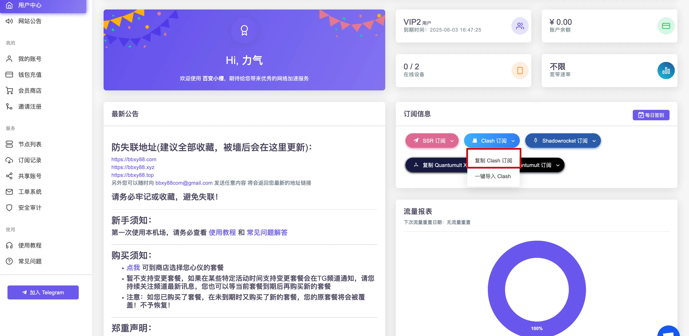
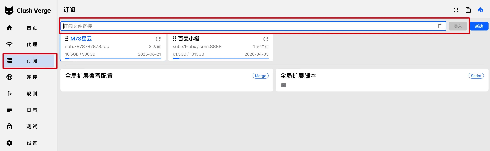
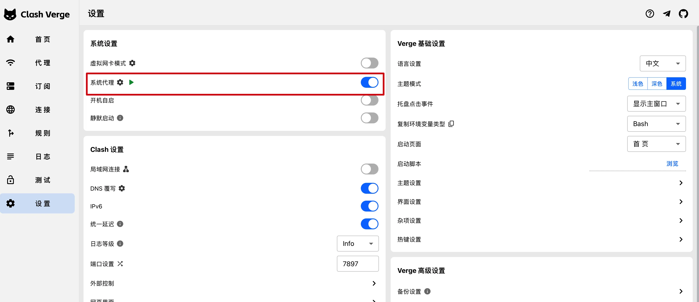
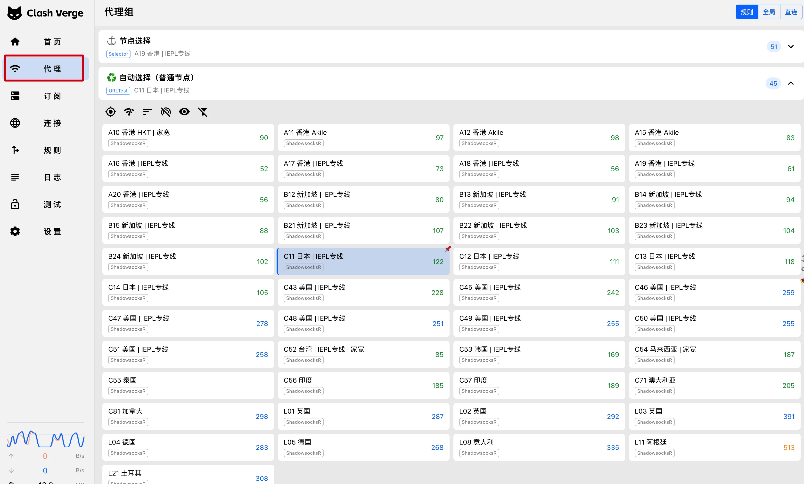
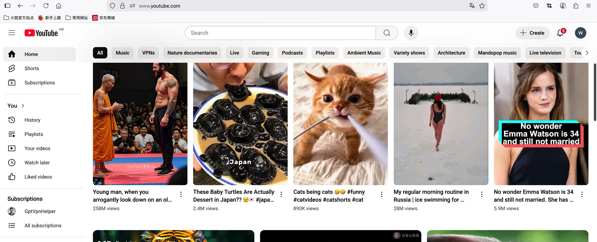

<!-- GitHub Pages mirror of ../clash.md. Keep both files aligned intentionally. -->
# 2026 Clash 机场零基础订阅图文教程（适合完全新手）

本教程只讲**通用操作流程**，不绑定某一家机场或某一个活动页。只要你手里有一条可用的订阅链接，绝大多数兼容 `mihomo` / `sing-box` 生态的客户端，都可以按本文完成基础配置。

> 还没决定用哪家服务？先看：[如何挑选优质 Clash 机场（避坑指南）](./choose.html)
>
> 已经导入成功，但“能连上却用不起来”？直接看：[独立排障页](./troubleshooting.html)

最近更新：2026-03-11

> 说明：原版 Clash（`Dreamacro/clash`）项目已基本停止维护；本文里的 “Clash” 泛指兼容规则分流生态的客户端/内核，2026 年更常见的是 `mihomo` 系客户端与相关前端。

---

## 这篇教程解决什么问题？

如果你是第一次接触这类工具，通常会卡在下面几件事：

- 不知道现在该下载哪个客户端；
- 不知道订阅链接在哪里复制；
- 不知道 `Rule`、系统代理、`TUN` 分别什么时候开；
- 不知道怎样判断“是真的连通了”，还是只是软件显示在运行。

本文就是把这几个最基础的问题走一遍，先让你**稳定跑起来**，再去研究更细的选线、选协议和分流。

---

## 使用前准备

- 一台可正常联网的设备：Windows / macOS / Android / iOS；
- 一条可用订阅链接，或者一个能登录机场后台的试用/付费账号；
- 10 到 20 分钟的完整配置时间；
- 一个基本原则：**先跑通，再折腾高级设置**。

---

## 1. 先拿到订阅链接

大多数机场后台都会提供 “订阅”、“一键导入”、“复制订阅链接” 这类入口。你真正需要的，是一条以 `https://` 开头、可以被客户端导入的订阅地址。

注意两点：

- 不要把订阅链接发给别人。它本质上就是你的账号密钥，泄露后可能被盗用流量；
- 最好把官网登录地址、订阅链接和备用网址单独保存，避免后面临时找不到入口。

下面这张图只是示意，不代表你必须使用同一个面板：

---

## 2. 下载适合你设备的客户端

2026 年新手优先选择仍在维护、支持 `mihomo`、支持 `Rule` 和 `TUN` 的客户端。

| 平台 | 推荐客户端 | 下载地址 |
| --- | --- | --- |
| **Windows** | Clash Verge Rev | [GitHub 下载](https://github.com/clash-verge-rev/clash-verge-rev/releases) |
|  | Mihomo Party | [GitHub 下载](https://github.com/mihomo-party-org/mihomo-party/releases) |
| **macOS** | Clash Verge Rev | [GitHub 下载](https://github.com/clash-verge-rev/clash-verge-rev/releases) |
|  | ClashX Meta | [GitHub 下载](https://github.com/MetaCubeX/ClashX.Meta/releases) |
| **Android** | Clash Meta for Android | [GitHub 下载](https://github.com/MetaCubeX/ClashMetaForAndroid/releases) |
| **iOS / iPadOS** | Shadowrocket | [App Store（付费）](https://apps.apple.com/app/shadowrocket/id932747118) |
|  | Stash | [App Store（付费）](https://apps.apple.com/app/stash-rule-based-proxy/id1596063349) |

下载时注意：

- 看清系统版本和芯片架构，不要把 macOS 的 Intel 版装到 Apple Silicon，或者把 ARM 版装到旧机器上；
- Windows 首次启用 `TUN` 时，可能需要管理员权限或额外安装驱动；
- iOS 常见客户端多为付费应用，且可能需要外区 Apple ID。

---

## 3. 把订阅导入到客户端

以 Clash Verge Rev 这一类桌面客户端为例，核心动作只有两个：

1. 粘贴订阅链接；
2. 点击导入或更新配置。

如果导入失败，先不要急着换机场，先确认：

- 订阅链接有没有复制完整；
- 客户端时间是否正确；
- 你当前网络是否能打开机场官网；
- 是否把链接粘贴到了错误的入口，例如“本地配置”而不是“订阅配置”。

---

## 4. 日常默认用 `Rule` 模式，并开启系统代理

对大多数新手来说，最稳妥的默认组合是：

- 模式选 `Rule`；
- 打开系统代理；
- 先不要一上来就用 `Global`。

`Rule` 的作用是让国内流量尽量直连、国外流量按规则走代理。这样通常比全局模式更适合日常使用，也更不容易把本地服务、银行网站、局域网设备一起代理出去。

经验上可以记成一句话：

- 浏览器和大多数软件，先靠系统代理；
- 只有“明明开着代理，但某些 App 还是不走”的时候，再去考虑 `TUN`。

---

## 5. 某些 App / 游戏不走代理时，再启用 `TUN`

`TUN` 的作用，是在更底层接管系统流量。它适合这些情况：

- 浏览器可以访问，但 Telegram / Discord / ChatGPT 客户端不行；
- 某些软件没有代理设置入口；
- 游戏或桌面应用不跟随系统代理。

但 `TUN` 不是“越早开越好”，因为它通常意味着：

- 需要额外权限；
- 会引入 DNS、驱动、系统兼容性问题；
- 排障时变量更多。

所以顺序建议始终是：

1. 先 `Rule` + 系统代理；
2. 确认浏览器连通；
3. 只有 App 还不通时，再启用 `TUN`。

---

## 6. 选择节点时，先看“稳定可用”，再看“最低延迟”

很多新手第一反应是只看延迟，但延迟低不一定代表真实体验最好。实际选择节点时，优先级建议是：

1. 地区是否符合你的需求，例如美区、日区、新加坡；
2. 线路是否稳定，例如中转、IEPL、IPLC；
3. 是否存在 AI / 流媒体可用性说明；
4. 在此基础上再看延迟和测速结果。

如果你只是日常网页、GitHub、轻度 AI 使用，先选一个**稳定节点**即可；不要刚导入就开始频繁切二三十个节点。

---

## 7. 用“最小闭环”验证是否真的配置成功

不要一上来就用一堆复杂服务测试。建议按这个顺序验证：

1. 打开 `https://www.youtube.com` 或 `https://github.com`，确认基础连通；
2. 再打开你真正要用的服务，例如 ChatGPT、Claude、Netflix；
3. 如果基础站点能开，而目标服务不能开，优先怀疑**地区/IP 可用性**，不是立刻怀疑客户端坏了。

这里有个很重要的认知：

- `YouTube` 能打开，只能说明基础代理通了；
- `ChatGPT` / `Claude` / 某些流媒体打不开，很多时候是节点地区、共享 IP 信誉、账号风控的问题。

---

## 8. 把“能用”变成“长期可用”

第一次跑通之后，建议立刻做这几件事：

- 开启“启动时自动更新订阅”或手动养成更新习惯；
- 保存至少 2 个不同地区的可用节点；
- 保存订阅链接、官网登录地址和备用网址；
- 记录自己当前可用的客户端版本，别随便回退到旧教程里的老客户端。

长期使用时，真正影响体验的通常不是“会不会导入”，而是：

- 晚高峰是否掉速；
- 规则集和 Geo 数据是否过期；
- 服务商公告和客服是否可联系；
- 你是否把所有希望都压在一个节点或一个服务上。

---

## 9. 新手最常踩的坑

### 下载了过时客户端

很多搜索结果还是旧教程，容易把人带到停更或维护不积极的客户端。2026 年新手优先看是否仍在维护、是否支持 `mihomo`、是否支持 `TUN`。

### 一上来就开 `Global`

`Global` 可以临时排障，但不建议拿来做长期默认模式。长期日常使用优先 `Rule`。

### 浏览器能开，App 不能开

这通常不是“机场坏了”，而是系统代理没有覆盖到该应用。优先检查 `TUN`、防火墙、应用自身缓存的 DNS。

### 软件显示连上了，但网页打不开

这通常优先排查：

- DNS；
- 系统时间；
- 规则集是否过期；
- 你是否误开了 `Direct`。

### 到处分享订阅链接

订阅链接不是邀请码，它和你的账号资源绑定。泄露后最常见的后果不是“被黑”，而是流量被别人直接用掉。

---

## FAQ（常见问题）

### Q1：客户端导入订阅失败怎么办？

- 先确认链接复制完整；
- 用浏览器打开机场官网，看面板是否正常；
- 尝试在客户端里重新新建订阅，而不是重复覆盖旧配置；
- 仍不行时，再看是否是客户端版本过旧。

### Q2：为什么我开着代理，但还是打不开网页？

- 检查是否处于 `Rule` 或 `Global`，不要误开 `Direct`；
- 检查系统时间和时区；
- 检查 DNS 设置；
- 更详细流程见：[独立排障页](./troubleshooting.html)。

### Q3：为什么延迟很低，但速度还是慢？

低延迟只说明“握手不慢”，不代表线路一定不拥堵。晚高峰、超售、地区出口质量，都会让测速和真实下载速度产生差异。

### Q4：为什么 YouTube 能开，ChatGPT 却不行？

这通常不是客户端配置问题，而是节点地区、共享 IP 信誉或账号风控问题。优先更换同地区不同节点，或者换支持地区。

### Q5：iPhone 上和电脑上为什么体验不一样？

iPhone 多数客户端是通过 VPN 模式接管流量，而桌面端常先走系统代理，所以表现不同很常见。桌面端优先检查系统代理、`TUN` 和防火墙。

---

> 本教程仅用于网络工具基础配置与科普说明，请遵守当地法律法规，不要用于非法用途。

## 推荐阅读

- [如何挑选优质 Clash 机场（避坑与选购指南）](./choose.html)
- [Clash / Mihomo 独立排障指南（按症状排查）](./troubleshooting.html)
- [Clash 机场常用名称解释](./mingci.html)
