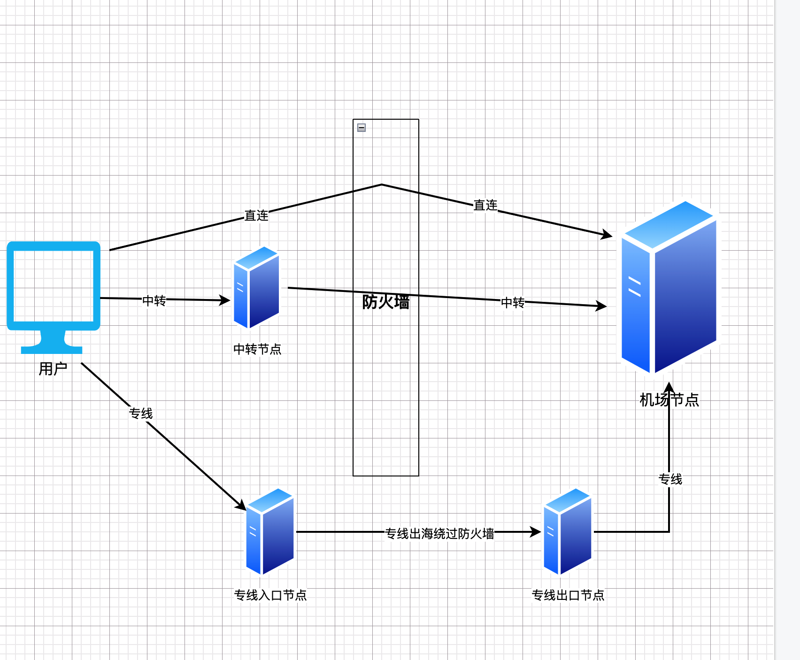

# Clash 机场线路类型详解：直连 / 中转 / 专线（IPLC / IEPL）区别与选择指南

深入解析 Clash 机场的直连、中转和专线三种线路类型，了解它们的网络路径、绕过防火墙的原理、速度对比、适用人群及优缺点，帮助你在 2025 年依然选到**稳定、顺滑、抗封锁能力强**的科学上网线路。

---

## 🔰 引言

在使用 Clash 或类似机场服务进行科学上网时，选择合适的网络线路尤为关键。不同的线路类型在稳定性、速度、抗封锁能力上有显著差异。本文将详细对比常见的三种类型：**直连**、**中转** 和 **专线（IPLC/IEPL）**，帮助用户根据自身需求做出最佳选择。

线路原理图

---

## 🚀 直连线路

### 📖 定义
直连是指用户的请求直接从本地网络跳转至机场节点，无中间转发服务器。

### ✅ 优点
- 成本低廉，很多机场默认提供
- 配置简单，适合新手用户

### ❌ 缺点
- 容易被GFW识别和封锁
- 网络质量极大受制于运营商和网络拥堵
- 峰值时段易丢包、延迟高

### 🛡️ 绕过防火墙原理
直连线路通常使用加密协议（如 Shadowsocks、V2Ray、VMess）来隐藏流量特征，试图绕过防火墙的检测。然而，由于流量直接经过 GFW，仍有被识别和封锁的风险。

### 📌 适用场景
对速度要求不高、预算有限的用户。

---

## 🌐 中转线路

### 📖 定义
用户请求先通过国内中转服务器，再转发至海外节点，缓解国内网络瓶颈。

### 🧩 常见类型
- 普通中转：基于一般服务器实现
- BGP 中转：具备智能路径选择，跨运营商中继效果更好

### ✅ 优点
- 相较直连，稳定性和速度有明显提升
- 一定程度上规避封锁
- 跨网传输表现更佳

### ❌ 缺点
- 成本提升，价格通常比直连贵
- 配置和维护较复杂，需机场服务方技术支持

### 🛡️ 绕过防火墙原理
中转线路通过在国内设置中转服务器，先将流量加密并发送到中转服务器，再由中转服务器转发至海外节点。此方式可以隐藏真实的访问目标，降低被 GFW 检测和封锁的风险。

### 📌 适用场景
对连接质量有一定要求的进阶用户，如远程办公、高清视频观看等。

---

## 💎 专线线路（IPLC/IEPL）

### 📖 定义
专线使用运营商级别的国际物理链路，数据从国内直接通过物理专线传送到海外节点，无经过公共网络。

### ✅ 优点
- 网络延迟极低，几乎不丢包
- 抗封锁能力最强
- 适用于游戏、流媒体等对延迟敏感场景

### ❌ 缺点
- 成本高昂，部分机场需额外购买
- 有些节点可能存在超售现象，高峰时段会影响体验

### 🛡️ 绕过防火墙原理
专线线路通过运营商提供的物理链路，数据不经过 GFW，避免了被防火墙检测和封锁的风险，提供了更高的安全性和稳定性。

### 📌 适用场景
游戏加速、高清视频、金融交易等对网络要求极高的用户。

---

## 📊 各线路类型对比一览表

| 特性         | 直连线路       | 中转线路        | 专线线路（IPLC/IEPL） |
|--------------|----------------|------------------|-------------|
| 成本         | 低             | 中等              | 高           |
| 延迟         | 高             | 中                | 低           |
| 稳定性       | 差             | 中等              | 极佳          |
| 抗封锁能力   | 弱             | 中等              | 极强          |
| 适合人群     | 新手入门用户   | 日常办公娱乐用户 | 追求极致体验用户    |

---

## 🎯 如何选择合适的线路类型

1. **新手用户 / 日常网页浏览**：推荐选择价格便宜的直连或普通中转线路。
2. **稳定性要求高**：如远程办公、网课，建议使用 BGP 中转线路。
3. **延迟敏感场景**：如游戏、流媒体、高频交易等，优先选择专线（IPLC/IEPL）。

---

## ❓ 常见问题解答（FAQ）

### Q1：直连线路为什么容易被封？
由于无额外加密和中转路径，GFW 识别直连请求非常容易，封锁概率高。

### Q2：BGP 中转与普通中转差别大吗？
BGP 中转通过多路径动态选择，跨网运营商效果好；普通中转路径固定，易拥堵。

### Q3：专线值得买吗？
如果你追求“秒开视频、超低延迟、稳定无波动”的体验，专线是目前最优选。

## 推荐阅读

- [机场推荐榜单 | 2025科学上网指南 ](https://gptvpnhelper.com/airport-access/)
